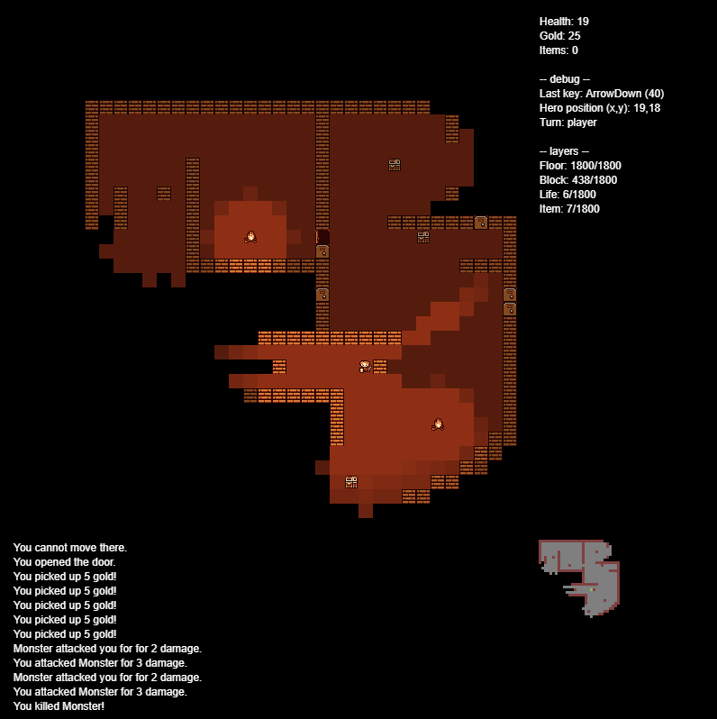

# rogue

## About
A small rogue-like game experiment!

This was a sandbox to teach myself TypeScript and PixiJS in 2017, and to epxeriment with GitHub Actions for GitHub Pages deployments in 2023.

The project will not receive any major updates. It contains many unfinished features, but several functional ones (A* pathfinding, lighting).

To try it out: https://cjshmyr.github.io/rogue/

## Compiling
To build, install `npm` & `Gulp`, then run `npm i` and `gulp`.

To run, open `dist/index.html` with a live server (an extension is automatically recommended for Visual Studio Code workspaces).

## Dependencies
PixiJS dependencies are currently included in this repository, as the targeted version is older and not available with package managers.

PixiJS (v4.5.2)
- Originally sourced from CDN: https://cdnjs.cloudflare.com/ajax/libs/pixi.js/4.5.2/pixi.min.js
- Located in [`src/assets/`](https://github.com/cjshmyr/rogue/tree/master/src/assets/)

PixiJS TypeScript definitions (v4.5.2)
- Originally sourced from official repository: https://github.com/pixijs/pixi-typescript/tree/v4.5.2
- Located in [`src/render/pixi-types/`](https://github.com/cjshmyr/rogue/tree/master/src/render/pixi-types)

## Art
Art provided by user [Jerom](https://opengameart.org/content/16x16-fantasy-tileset) on opengameart.org.
